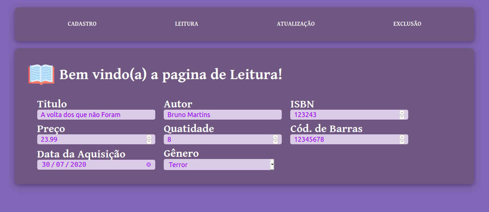
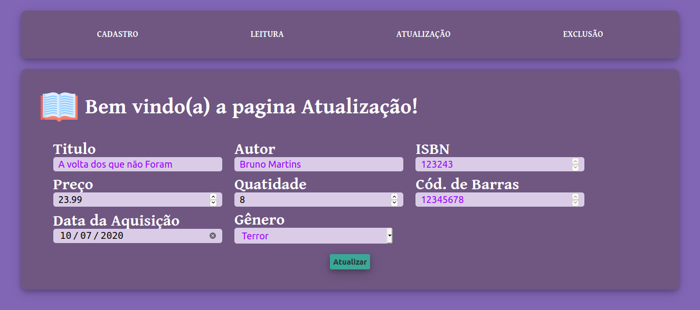
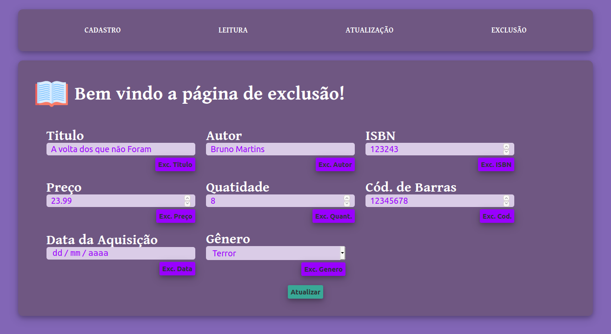

# PRÁTICA de DESENVOLVIMENTO WEB –HTML<form>

**Objetivo:** criar 4páginas HTML para cadastro (Create), leitura (Read),atualização (Update) e exclusão (Delete) –CRUDde dadosde algum usuário (pessoa), produto (smartphone por exemplo), serviço (consertar computador) ou outra entidade.

## Requisitos

- Criar 4páginas HTMLem arquivos separados, como especificado abaixo:
    - **cadastro.html :** todos os campos devem estar habilitados, usarvários tipos de tags HTML para diferentes informações de um produto, usuário, etc.
    - **leitura.html :** nenhum campo deve estar habilitado, pois é uma página somente de leitura! Os campos devem exibir a informação, mas não podem permitir a edição.

        Exemplo: (não é possível editar o nome, usem o atributo adequado para este efeito )

    - **atualização.html :** alguns campos devem permitir edição, por exemplo, nome ou endereço de uma pessoa, mas outros não podem ser editados, como o CPF.Use seu senso crítico para saber o que pode ser editável ou não.
    - **exclusao.html :** deve possuir alguns atributos do usuário ou produto que podem ser excluidos, cada atributo deve ter um botão ao lado permitindo a exclusão. Não haverá ação, somente a estrutura dos botões.

**Tempo para realização:** Acompanhar o prazo no Google Classroom. Enviar peloGoogle Classroom, na atividade criada vai ter uma questão para enviar um arquivo.O arquivo deve estar em formato .zip ou .rar e conter os arquivos HTML pedidos.

# Resultado

## Cadastro

## Leitura

## Atualização

## Exclusão
